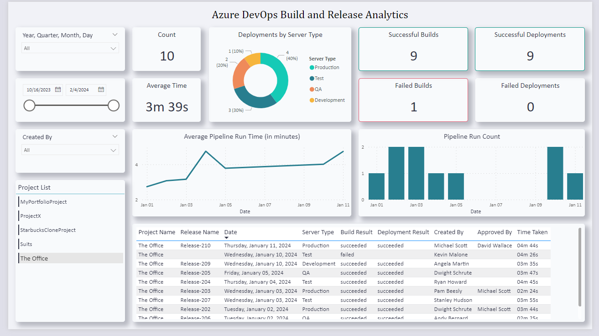

# Azure DevOps Build and Release Analytics



## Overview

This project is a C# console application that leverages the Azure DevOps REST API to gather data related to builds and releases. The collected data is stored in a database for further analysis. Additionally, a Power BI dashboard is created to visualize and explore the analytics derived from the gathered data.

## Features

- **Azure DevOps Integration:** Utilizes Azure DevOps REST API to fetch information about builds and releases.
- **Database:** Stores the retrieved data in a SQL server database for efficient data management.
- **Power BI Dashboard:** Creates an interactive Power BI dashboard for visualizing build and release analytics.

## Technologies Used

- C# for console application development.
- Azure DevOps REST API for data retrieval.
- SQL Server database for data storage.
- Power BI for dashboard creation and visualization.

## Project Structure

- `ConsoleApp`: Contains the C# console application.
- `DatabaseScripts`: SQL scripts for creating the database.
- `PowerBIDashboard`: Power BI file for the analytics dashboard.

## Setup Instructions

1. Clone the repository to your local machine.
2. Open the solution in Visual Studio or your preferred C# IDE.
3. Update the Azure DevOps API credentials and connection string for the database.
4. Create a Database as "AzureAnalytics" and run scripts to create Tables and View.
5. Run the console application to gather and store data.
6. Open the Power BI file to explore the analytics dashboard.

## Deployment Options (How to Use in Production for Automatic Data Retrieval)

Choose one of the following options to deploy the console app and retrieve data from Azure.

1. **Manual Execution:**
   - Run the application manually.

2. **Scheduled Task with Task Scheduler:**
   - Set up a scheduled task in Windows Task Scheduler for automated execution.

3. **Azure Functions:**
   - Convert the application into an Azure Function for serverless, scheduled execution.

4. **Docker Container with Kubernetes:**
   - Dockerize the application and deploy it using Kubernetes for container orchestration.


## Project Configuration

This console app is designed to be easily configurable for different Azure DevOps projects within the organization. The `ProjectRelatedInfo` class in the codebase centralizes project-related information. You can simply update the `ProjectNames` list in this class, and the application will dynamically fetch data for each specified project during execution.

### Example:

```csharp
public class ProjectRelatedInfo
{
    public static List<string> ProjectNames = new List<string>()
    {
        "StarbucksCloneProject",
        "MyPortfolioProject",
        "ProjectX",
        "Suits",
        "The Office"
    };
}
```

## Future Enhancements

1. Integration of Azure KeyVault to manege User Secrets.
2. Switch between Light and Dark mode in Power BI Dashboard.

## Theme Used in Power BI Dashboard

[Download Metricalist Power BI Light Theme](https://community.fabric.microsoft.com/t5/Themes-Gallery/Simply-Modern-Light/m-p/2111796#M567)

[Download Metricalist Power BI Dark Theme](https://community.fabric.microsoft.com/t5/Themes-Gallery/Simply-Modern-Dark/m-p/2088606)


## Author

Vishal Mishra
